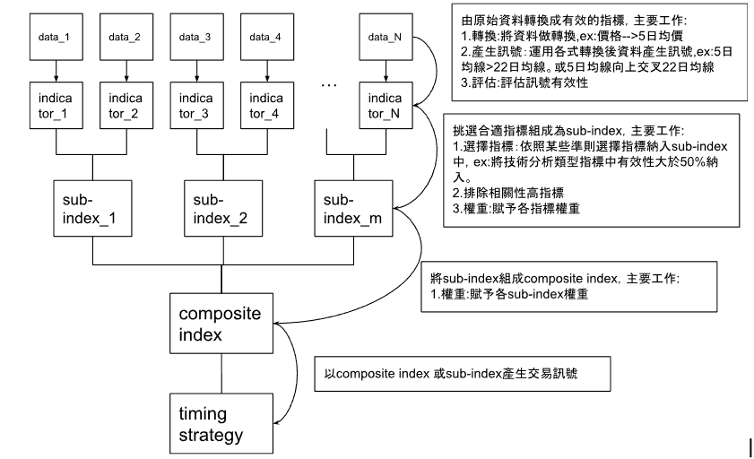
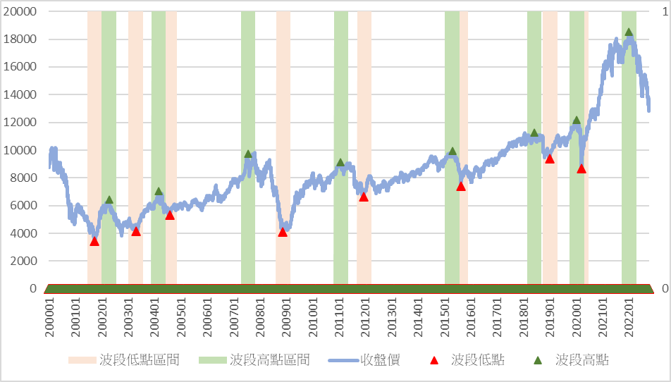
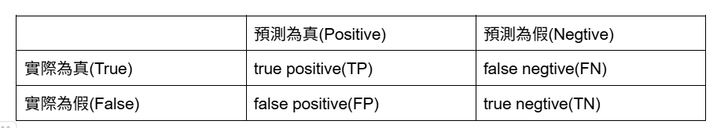
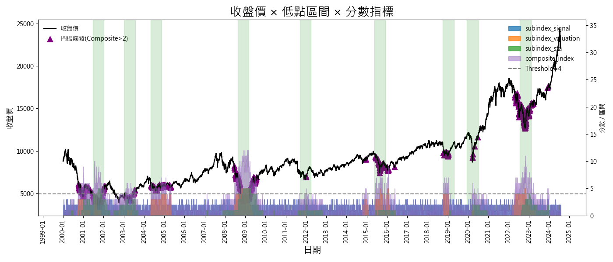
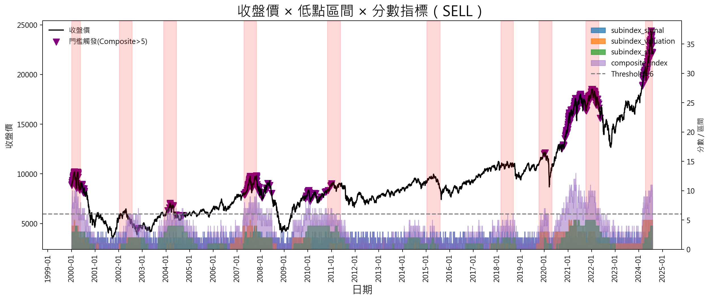

<div align="center">

# 📈 大盤多空綜合指標（Market Composite Indicator）

_量化研究實習專案｜Market Composite Indicator for Timing the Market_


</div>


> 量化研究實習專案｜以多源資料建立「大盤擇時」的可解釋綜合指標與視覺化報表

---

# **大盤多空綜合指標(Market Composite Indicator)**

## 前言：
投資方法常被分為兩類：**選股（相對報酬）**與**擇時（絕對報酬）**。本專案聚焦於**大盤擇時**，希望在**上漲前布局**、**下跌前減碼**，使投資組合能從僅追求相對績效，進一步提升至**穩定的絕對報酬**。

我們仿照「投資委員會」的決策過程：每一類資料都視為一位「專家」，先將各自的原始資料**轉換為可判讀的訊號**，再透過一套**客觀的有效性衡量**挑選成分，最後**加總形成綜合指數**，並以**門檻判斷**產生進出場訊號與視覺化報表。


## 研究目的：
編制一個可衡量大盤多空狀態的指標，作為輔助投資決策的良好工具。

        
## 研究架構：




在進入具體的指標範例之前，先介紹兩個核心概念：「神的領域」與「混淆矩陣」。  
前者強調直觀上的多空區間判斷，後者則提供量化的評估方法。這兩者結合，能更全面檢驗一個指標的擇時能力。

### 🔮 神的領域 (God’s Zone)
在大盤擇時研究中，研究者會先定義出 **波段高低點**，例如：上漲波段的起點與終點。  
這些精準的轉折點被稱為「神的訊號」，因為只有全知全能的「神」才能事先知道。  
進一步地，將「神的訊號」前後一段時間（如 3 個月）定義為 **神的區域 (God’s Zone)**。  
若指標訊號出現在神的區域內，則視為有效，否則為無效。這種方法能直觀檢視一個指標是否具備擇時能力。



---

### 📊 混淆矩陣 (Confusion Matrix)

為了更客觀衡量指標效能，可以引入機器學習常用的 **混淆矩陣 (Confusion Matrix)**：  

- **TP (True Positive)**：指標發出多頭訊號，且實際在神的區域內。  
- **TN (True Negative)**：指標無訊號，實際也不在神的區域內。  
- **FP (False Positive)**：指標發出訊號，但不在神的區域內。  
- **FN (False Negative)**：指標無訊號，但實際在神的區域內。  

透過 Accuracy、Precision、Recall 及 F-Score 等指標，可以更全面地量化判斷一個指標的好壞。




---

## 專案亮點（Highlights）

- **可解釋**：從單一資料的轉換與判讀，到混淆矩陣與 F-score 的量化衡量，完整記錄決策邏輯。  
- **系統化選指標**：依據 `precision / recall / fscore` 等衡量，從多個資料來源挑出 Top-N 成分。  
- **分層組合**：先在「signal / valuation / status」三大子類別內形成 **Sub-Index**，再加總為 **Composite Index**。  
- **自動門檻最佳化**：以最小訊號數門檻（例如 ≥2% 交易日）與指定衡量（如 precision）尋找最佳觸發閾值。  
- **專業視覺化**：價格走勢 × 波段區間 × 指標分數堆疊，並標出門檻觸發點，輸出高解析圖檔。  

---

## 專案架構（Architecture）

```
.
├─ data/                     # 原始與中繼資料（sn.csv, sn_dir.csv, ms.csv ...）
├─ data_buy/                 # Buy 方向的表格與圖（程式自動輸出）
├─ data_sell/                # Sell 方向的表格與圖（程式自動輸出）
├─ acc_matrix.py             # 指標有效性衡量（Accuracy / Precision / Recall / F-score / 與神的距離）
├─ find_important_sig.py     # 依衡量挑選 Top-N 成分、建 sub-index、做成績效表
├─ visualize.py              # 視覺化（價格 × 波段區間 × 指標分數 × 門檻觸發）
└─ main.py                   # 主流程（讀資料 -> 衡量 -> 選指標 -> 合成 -> 門檻最佳化 -> 輸出）
```

- **有效性衡量**：`acc_matrix.acc()` 同時計算 Accuracy、Precision、Recall、F-score(β可調，預設 0.5)、以及**與神的距離（平均訊號距最鄰近高/低點的天數）**。  
- **成分挑選與 Sub-Index**：`find_important_sig.calculate_index()` 會依指定衡量（如 `precision`）挑出前 `top_n`，加總成子指數並**自動搜尋最佳二元化門檻**。  
- **主流程**：`main.py` 同步處理 **Buy** 與 **Sell** 兩個方向，分別輸出子表 `sub1/sub2/sub3`、主表 `main_sheet.csv`，與圖檔。  
- **圖像輸出**：`visualize.py` 提供 `plot_lowzones_with_price()` 與 `plot_highzones_with_price()`，支援中文字型、雙 Y 軸、區間著色、堆疊分數、門檻線與觸發標記。  

---

## 安裝與環境（Setup）

### 1) 需求（建議）
- Python 3.10+
- 套件：`pandas`, `numpy`, `matplotlib`

### 2) 安裝
```bash
pip install -r requirements.txt
# 若未提供 requirements.txt，可自行安裝：
pip install pandas numpy matplotlib
```

### 3) 資料放置
- `data/sn.csv`：各指標的每日訊號矩陣（含「日期」欄）。  
- `data/sn_dir.csv`：指標目錄與屬性（欄位需含 `indicator_id` 索引與 `訊號類型`、`name` 等）。  
- `data/ms.csv`：大盤價量與「波段高低點/區間」等欄位（含「日期」欄）。  
> 主程式會根據 `sn_dir.csv` 中的 `訊號類型 ∈ {signal, valuation, status}` 進行分群與建模。

---

## 一鍵執行（Quick Start）

### 指定衡量指標（例：使用 `precision` 做挑選與門檻最佳化）
```bash
python main.py precision
```
程式將：
1. 讀取 `data/` 中的 `sn.csv`, `sn_dir.csv`, `ms.csv`。  
2. 依 `訊號類型` 切成三組：`signal / valuation / status`，各自計算有效性（Buy/Sell）。  
3. 在每組內挑選 **Top-N**（預設 10）作為成分，形成 **Sub-Index**，並以**最少訊號數（≥2%）**的限制搜尋最佳門檻。  
4. 將三個 Sub-Index 相加為 **Composite Index**，再次搜尋最佳門檻，於主表寫入 `(measurement, num_signal)`。  
5. 產生報表與圖：  
   - `data_buy/sub1.csv, sub2.csv, sub3.csv, main_sheet.csv`；`data_buy/lowzone_buy.png`（買進面向）  
   - `data_sell/sub1.csv, sub2.csv, sub3.csv, main_sheet.csv`；`data_sell/highzone_sell.png`（賣出面向）  

---

## 數據處理與衡量方法（Methodology）

### 1) 單一資料 → 訊號
- 閥值（Threshold）/ 交叉（Cross）/ Z 分數 / 百分位 等方式轉換成 0/1 訊號（具體轉換於資料前處理階段完成）。  
- 範例：`M1B YoY > 10%` 視為高水位；技術面如 KD > 80 視為超買等。

### 2) 有效性衡量（Confusion Matrix & F-score）
- `acc_matrix.acc()` 同時計算以下指標（Buy 與 Sell 路徑不同，分別對應「波段低/高點區間」）：  
  - `accuracy`, `precision`, `recall`, `fscore(β=0.5)`  
  - **與神的距離**（訊號到最近高/低點的平均天數）  
  - 並回傳訊號數 `num_signal`（含二元化後的加總欄位切片）。

### 3) 成分挑選與子指數（Sub-Index）
- 先按指定衡量排序、擇前 `top_n` 成分（如 `precision` 前 10）。  
- 子指數為該組成分之**逐日加總**，接著針對子指數做**門檻最佳化**並二元化（例：`sum > threshold` → 1）。

### 4) 綜合指數（Composite Index）與門檻最佳化
- 取三個子指數相加為 `composite_index`，再在**全期間**內搜尋使指定衡量最佳的門檻；同時要求**訊號數**不可低於**樣本數的 2%**（避免過度擬合）。

---

## 視覺化（Visualization）

- **低點面向**：`plot_lowzones_with_price()`  
  - 左軸：收盤價；右軸：子指數堆疊 + 綜合指數（區塊填色）。  
  - 畫出**波段低點區間**（綠色陰影）與**門檻線**；當 `Composite > Threshold` 於價格圖上以 `^` 標示。  

- **高點面向**：`plot_highzones_with_price()`  
  - 類似設計，但為**波段高點區間**（紅色陰影），觸發點以 `v` 標記。  


*圖：低點面向（Lowzone Buy Output）*


*圖：高點面向（Highzone Sell Output）*

> 兩者皆支援中文字型與自動偵測日期欄位，最終圖檔會輸出到 `data_buy/lowzone_buy.png` 與 `data_sell/highzone_sell.png`。

---

## 重要參數與預設

- **Top-N 成分數**：`top_nn = 10`（可於 `main.py` 內調整）。  
- **最小訊號數門檻**：預設 **2%** 交易日（子指數與綜合指數最佳化時皆適用；早期版本子指數為 4%）。  
- **衡量指標**：啟動指令的第一個參數，如 `precision`, `fscore`。  
- **價格欄自動偵測**：`visualize.py` 會在 `["收盤價_調整後","盤價","收盤價","Close","Adj Close","close"]` 之間尋找。  

---

## 輸出成果（Artifacts）

- **表格**（CSV）  
  - `data_buy/sub1.csv`（signal 組 Top-N 與績效）  
  - `data_buy/sub2.csv`（valuation 組 Top-N 與績效）  
  - `data_buy/sub3.csv`（status 組 Top-N 與績效）  
  - `data_buy/main_sheet.csv`（近 5 日 Composite 與最佳化結果）  
  - `data_sell/` 下對應檔案（賣出面向）  
- **圖檔**（PNG）  
  - `data_buy/lowzone_buy.png`  
  - `data_sell/highzone_sell.png`  

> 主表中會在 `composite_index` 那一列寫入 `(measurement, num_signal)`，以便快速檢視最佳化後的表現與訊號覆蓋率。

---

## 延伸與客製化（Extensibility）

- **加入新資料來源**：將轉換後的 0/1 訊號欄加入 `sn.csv`，並在 `sn_dir.csv` 設定 `訊號類型` 與對應 `name` 即可自動納入流程。  
- **更換評估指標**：啟動時改傳 `fscore` 或自定義衡量（進階：可於 `acc_matrix.py` 擴增）。  
- **門檻策略**：可替換最佳化目標（例如改用 `recall` 或彈性 β 的 `Fβ-score`）。  
- **圖表主題**：可在 `visualize.py` 調整配色、標記與字型，或輸出互動式圖表。  

---

## 風險聲明（Disclaimer）

本專案僅作為研究與展示用途，不構成投資建議。歷史回測不代表未來績效，請自行評估風險。

---

## 參考檔案（Key Files）

- 指標有效性衡量：`acc_matrix.py`（Accuracy / Precision / Recall / F-score / 與神的距離）   
- 成分挑選與子指數：`find_important_sig.py`（Top-N、子指數與門檻最佳化）   
- 主流程：`main.py`（資料讀取、分群、合成、最佳化、輸出）   
- 視覺化：`visualize.py`（低/高點區間 × 價格 × 分數 × 門檻觸發）   

---

**作者**：`Your Name`（可替換）  
**聯絡**：`email@example.com`（可替換）

